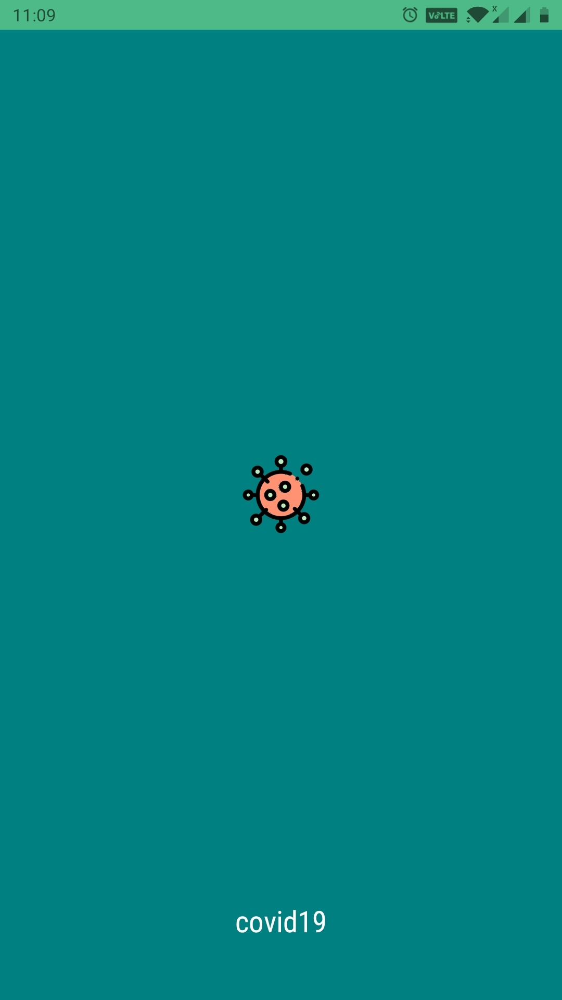
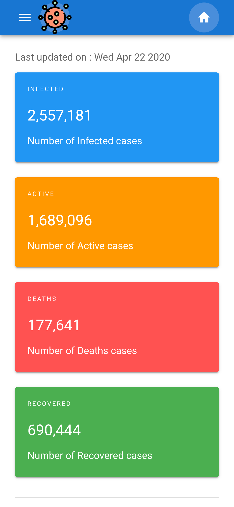
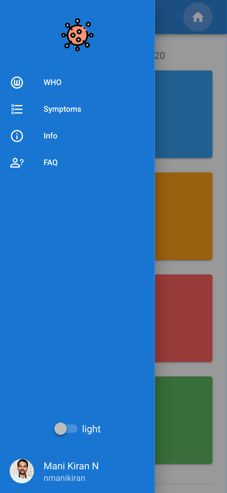
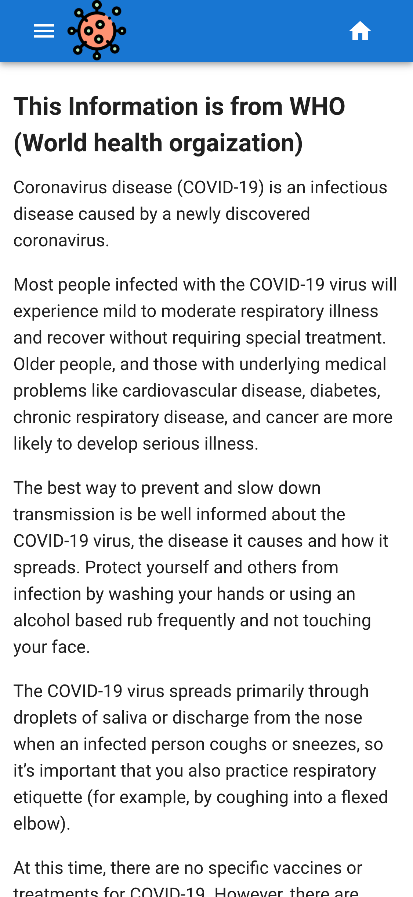
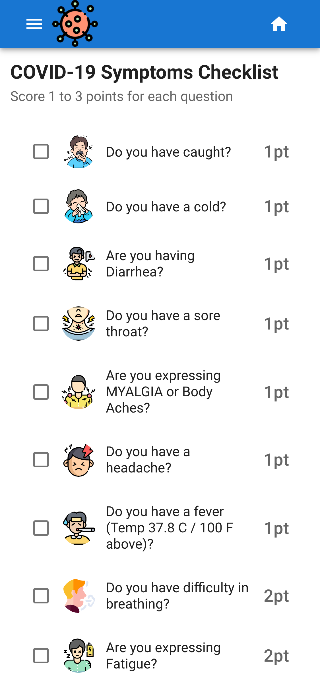
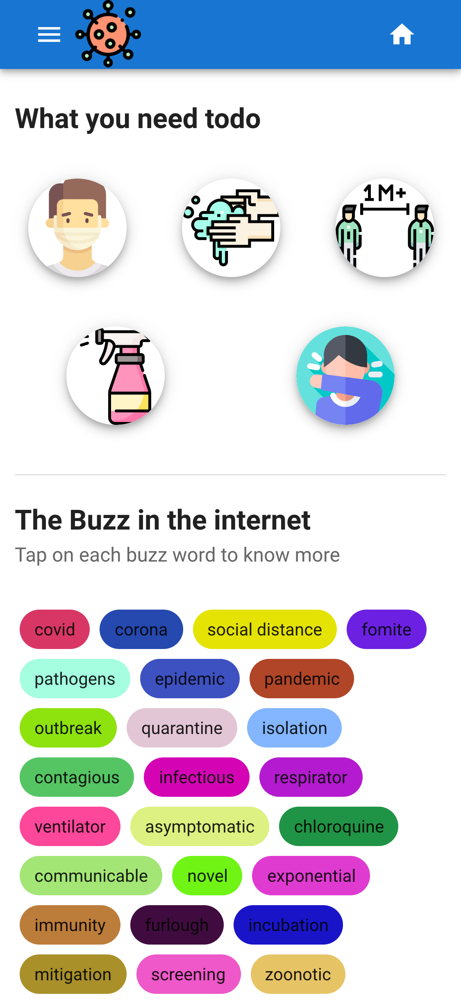
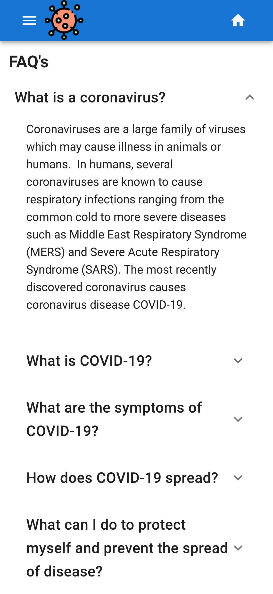
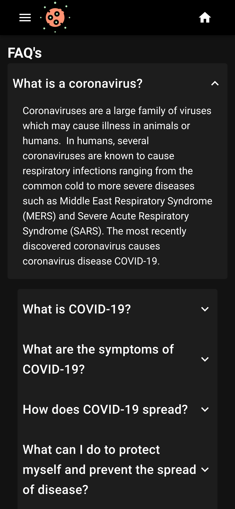

# covid19

This site will provide stats relate to corona-virus cases, information that WHO provided to fight against covoid19 in pictorial representation, symptoms checklist and many more

## Found this project useful?

If you found this project useful, then please consider giving it a ⭐️ on Github and sharing it with your friends via social media.

 

## Requirements

[Node.js](https://nodejs.org/en/)

## Project setup

- git clone https://github.com/nmanikiran/covid19.git
- cd covid19
- rename `.env.sample` to `.env` and update the Env variables
- npm install

### Compiles and hot-reloads for development

- npm run serve

## Screenshots - Here is how it looks

 |
 |
 |
 |
 |
 |
 |
 |

## Contributing

Awesome! Contributions of all kinds are greatly appreciated. To help smoothen the process we have a few non-exhaustive guidelines to follow which should get you going in no time.

## Using GitHub Issues

- Feel free to use GitHub [issues](https://github.com/nmanikiran/covid19/issues) for questions, bug reports, and feature requests
- Use the search feature to check for an existing issue Include as much information as possible and provide any relevant resources (Eg. screenshots)

## Submitting a Pull Requests

I welcome and encourage all pull requests. It usually will take me within 24-48 hours to respond to any issue or request. Here are some basic rules to follow to ensure the timely addition of your request:

- Match the document style as closely as possible.
- Please keep PR titles easy to read and descriptive of changes, this will make them easier to merge :)
- Pull requests must be made against the development branch for this particular repository.
- Check for existing issues first, before filing an issue.
- Make sure you follow the set standard as all other projects in this repo
- Have fun!

## Recommended / Preferred

[VS Code](https://code.visualstudio.com/download)

## Contributors

<table>
  <tr>
    <td align="center"><a href="http://nmanikiran.com"> <b>Mani Kiran N</b></a> 
    <a href="#" title="Code">💻 </a>
    <a href="#" title="Documentation">📖</a>
    <a href="#" title="Ideas">🤔</a>
    <a href="#" title="Reviewed Pull Requests">👀</a>
    <a href="#" title="Maintenance">🚧 </a>
    </td>
    <td align="center"><a href="https://curioustushar.github.io/"> <b>Tushar Gupta</b></a> 
    <a href="#" title="Code">💻 </a>
    <a href="#" title="Answering Questions">💬 </a>
    </td>
    <td align="center"><a href="https://github.com/NivyaPallempati"> <b>Nivya Pallempati</b></a> 
    <a href="#" title="Code">💻 </a>
    <a href="#" title="Answering Questions">💬 </a>
    </td>
  </tr>
</table>

## Thanks & Credits to

[lmao.ninja](https://corona.lmao.ninja/docs/#/)
